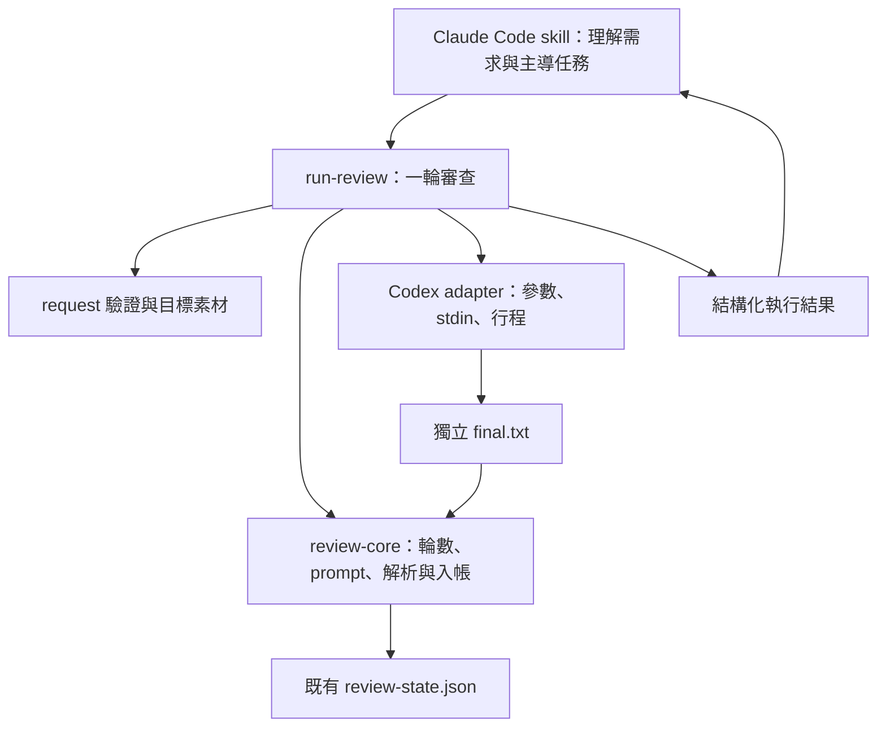

# Claude Code × Codex 整合規劃

日期：2026-09-05。狀態：**設計草案，尚未實作、未經獨立模型審查、未凍結**。

使用者目標：讓目前整合 Claude Code 與 Codex 的 skill 更可靠、更容易使用，並保留未來從任一工具啟動的能力。本次交付為完整規劃；本文件中的新指令、檔案與設定都是預定介面，現在不能執行。

## 1. 決策摘要

保留「一個主導者、一個異廠商唯讀審查者」。先把 prompt 組裝、Codex 呼叫、最終答案取得、RC 與審查入帳收進單一 runner；既有 skill 改成薄操作入口。

實作分階段：

| 階段 | 交付 | 完成後能做什麼 |
|---|---|---|
| P1 | Codex review runner、最終答案檔、共用審查核心 | Claude 用一個指令執行並記錄一輪 S3 或 S5 |
| P2 | 下游實際驗收、修正 P1 使用問題 | 確認真實任務能跑通，保留簡短操作證據 |
| P3 | 結構化 findings，獨立版本發布 | 用 JSON Schema 交接 findings，保留舊狀態讀取 |
| P4 | Claude adapter 與 Codex 薄入口 | 支援 Claude→Codex、Codex→Claude 兩種方向 |

P1 是下一個可實作範圍；P3、P4 是有進場條件的後續規劃，不隨 P1 自動出貨。GREEN 語意、規格修訂強制複審、全面流程編排另案處理。

## 2. 現況與證據

| 目前機制 | 已具備的能力 | 仍依賴操作者的部分 |
|---|---|---|
| `skills/spec-pipeline/SKILL.md` | F0、S0–S5、監督者責任 | 順序、模型切換、驗證與最終收尾 |
| `skills/codex-review/SKILL.md` | Codex 參數、effort 規則、輸出契約 | 主模型每次自行組 prompt、shell、RC 與入帳 |
| `scripts/review-state.mjs` | findings 解析、輪數、resolve、複審素材 | 外部提供的 `--rc` 與 `--log` 是否來自當次呼叫 |
| `scripts/spec-freeze.mjs` | 規格內容雜湊、drift 與 delta | `--revise` 後是否真的再審；resolve-all 後是否複審 |
| `scripts/lib/state-lock.mjs` | 同步更新互斥、原子寫檔 | 不支援直接包住非同步 callback；不是多任務隔離 |

2026-09-05 在這台 Mac：既有測試通過 105 項，plugin 結構檢查通過；`codex-cli 0.153.4` 的 help 列出 `-o`、`--output-schema`、`--json`。這些數字是當次觀察，不是支援版本下限，也不代表下游 S3/S5 真實模型驗收已完成。

重驗：

```bash
codex --version
codex exec --help
node --test plugins/spec-pipeline/tests/*.test.mjs
node scripts/validate-plugin.mjs
```

官方依據（2026-09-05 已開啟核對）：

- [Codex non-interactive mode](https://learn.chatgpt.com/docs/non-interactive-mode)：`-o` 保存最後訊息，`--output-schema` 約束最終回應 JSON 形狀，`--json` 輸出執行事件。這三個用途不同。
- [Claude Code programmatic usage](https://code.claude.com/docs/en/headless)：`claude -p` 支援非互動呼叫；`--output-format json` 搭配 `--json-schema` 提供結構化結果。Claude adapter 尚未在本機實際驗收。

實作當天重新核對上述介面與必要能力，不沿用機器版本推定其他機器的能力。

## 3. 成功條件與範圍

### 3.1 P1 必須達成

- C1：執行一輪 S3/S5 只需一個 runner 指令；主模型不再傳入自行取得的 Codex RC 或答案路徑。
- C2：prompt 固定部分、哨兵格式、effort 計算與複審規則有單一程式來源。
- C3：只有此次 Codex 行程正常退出且獨立 final 檔可用，才可能記為有效審查輪。
- C4：stdout/stderr 裡出現格式範例或零 BLOCKER 文字，不會取代 final 檔。
- C5：既有狀態可讀、原 CLI 仍可使用；輪數與 GREEN 的既有語意不被悄悄改寫。
- C6：達上限、設定錯誤或鎖被占用時，在模型呼叫前停止。
- C7：格式錯誤、逾時、取消、狀態寫入失敗都有明確結果；不自動重新呼叫付費模型。
- C8：收到有效 findings 與整個任務完成分開呈現；runner 不輸出 GREEN 或替使用者接受風險。

### 3.2 P1 明確排除

不代替主對話執行 S1/S2/S4、F0、verify_cmd、freeze/revise、commit、push 或 deploy；不自動修改程式、不自動 resolve、不切主對話模型。

不增加 MCP server、SDK 依賴、模型投票、自我評分、多任務隔離、遙測、ROI 實驗、GitHub Actions 或新 GREEN 狀態機。遵守 LEDGER D1–D9；新 runner 的呼叫互斥用於保護既有單任務操作，不宣稱解決 D9。

## 4. 架構與責任



| 元件 | 責任 | 不得承擔 |
|---|---|---|
| 主對話 | 任務範圍、規格、實作、逐條驗證與最終交代 | 把 runner RC=0 說成任務通過 |
| runner | 檢查、取鎖、組 prompt、呼叫、處理錯誤、入帳 | 決定 finding 的產品重要性或自動修復 |
| review-core | 沿用既有輪數、parser、複審規則與狀態轉換 | 直接執行 CLI、讀環境、`process.exit()` |
| Codex adapter | 唯讀呼叫 Codex，回報退出碼／signal／檔案 | 判定是否 GREEN、遞迴啟動 pipeline |
| 狀態檔 | 當前任務操作狀態與本輪 findings | 防篡改紀錄或模型確實理解程式的證明 |

共享上下文以規格、diff、原始碼位置、驗收條件、前輪 findings 與修正說明為主。審查者可以自行查來源；摘要不替代查證。P1 每輪開新的 Codex 呼叫，不依賴 session resume 或主模型完整聊天紀錄。

## 5. P1 對外介面

### 5.1 執行命令

```bash
node "${CLAUDE_PLUGIN_ROOT}/scripts/run-review.mjs" --request /absolute/path/review-request.json
```

runner 工作根目錄是呼叫時的 `cwd`，啟動後正規化為絕對路徑；從自己的模組位置解析 plugin 內部檔案，不依賴 `CLAUDE_PLUGIN_ROOT` 環境變數。上例變數僅用於 Claude 端找到入口。

單一必填 `--request`；另提供 `--help`。P1 不提供任意 prompt、任意額外 CLI flags、外部 RC、舊 log 匯入或自動 retry 選項。未知旗標直接拒絕。

### 5.2 Request v1

S3 初審範例：

```json
{
  "version": 1,
  "stage": "S3",
  "task": "加入訂單取消功能",
  "difficulty": "normal",
  "target": {
    "kind": "spec",
    "spec_path": "plan/orders/design.md"
  },
  "timeout_ms": 1200000
}
```

S5 範例：

```json
{
  "version": 1,
  "stage": "S5",
  "task": "加入訂單取消功能",
  "difficulty": "normal",
  "target": {
    "kind": "worktree",
    "base_sha": "0123456789abcdef0123456789abcdef01234567"
  }
}
```

| 欄位 | 規則 |
|---|---|
| `version` | 必填，僅接受整數 1 |
| `stage` | 必填，僅 `S3` 或 `S5` |
| `task` | 必填非空字串；trim 後與既有 stage task 完全相同才可續跑 |
| `difficulty` | 必填 `normal` 或 `hard`；來自既有 S0，runner 不重新判語意 |
| `target.kind` | S3 接受 `spec` 或 `spec-delta`；S5 僅接受 `worktree` |
| `target.spec_path` | `spec` 必填；專案內既存 UTF-8 一般檔案，symlink 解析後不得越出專案 |
| `target.base_sha` | `worktree` 必填、完整且可解析為 commit 的 SHA；不接受 `HEAD`、分支名或縮寫 |
| `timeout_ms` | 選填，預設 1,200,000；整數 1,000–3,600,000，0 不代表無限 |

request 本身可以放在暫存目錄。所有 target 路徑相對專案根目錄解讀。未知欄位、錯誤型別、錯誤 stage/kind 組合一律 RC=2；`spec-delta` 不接受呼叫者自填 delta，從既有 freeze 狀態取得。

完整 SHA 的例子僅示意長度。基準必須由主對話在任務開始、修改前取得並保存；runner 能驗 SHA 存在，不能證明它就是正確的入場基準。缺基準不得自動補目前 HEAD。

新增 request schema 與驗證器要共用同一份定義。現有小型 pipeline validator 不支援的 discriminated union／數值條件，不得假裝已驗證；可用明確的專用驗證函式，並以每種 target 的正反案例檢查與 schema 一致，無需引入通用 schema 套件。

### 5.3 專案設定與模型

P1 不新增 pipeline.json 欄位；仍以既有 validator 檢查設定。缺設定回 RC=10，設定有誤回 RC=2，不呼叫模型。

Codex model 初始值維持既有 `gpt-5.6-sol`，集中到 `lib/review-policy.mjs`；doctor 的模型檢查改讀同一來源。skill 只指向 policy，不再維護第二份參數表。P1 不順便升級模型。

effort：

- 初審 `hard` 優先使用 `xhigh`，即使行數少於 50；這明確化既有表格條件重疊時的優先序。
- 其餘初審：小於 50 行用 `low`，50–300 行用 `medium`，大於 300 行用 `xhigh`。
- R2 起：上一輪實際要求值 `xhigh/high → medium`、`medium → low`、`low → low`。
- 舊輪次缺 effort metadata：使用 `low` 並在結果印出 `LEGACY_EFFORT_UNKNOWN`；這是保守相容預設，不宣稱還原了上一輪旗標。
- 執行失敗不算有效輪，重試仍按同一個有效輪次推算 effort。

行數只計 review target；spec 為文件邏輯行數，spec-delta 為增加＋刪除行數，worktree 為基準至工作樹的增加＋刪除行數加未追蹤文字檔行數。二進位或無法可靠計數的項目用 `xhigh` 初審並附提示，不默認為 0 行。

## 6. 目標內容與 prompt

### 6.1 S3

`spec`：runner 讀取指定文件原文並放入 prompt，標明相對路徑，允許審查者查證所引用的原始碼與外部文件。

`spec-delta`：要求有已凍結規格、存在最近一次 revision，且當前規格內容與 freeze 狀態一致；讀取完整當前規格與最近 delta。prompt 指定審查重點是 delta 及其對既有條件的影響，完整規格供查證。不得把「傳了 revision 號／hash」視為已複審。

### 6.2 S5

target 是 `base_sha` 至目前工作樹的完整差異，包含已 commit、staged、unstaged、刪除與 rename；用 git 的 NUL 分隔輸出處理含空白等檔名，不依換行拆檔案清單。另列出未追蹤且未被 gitignore 忽略的檔案；可讀文字內容作為附加目標。

不提供額外 `paths` 過濾，以免主模型漏列有問題的修改。diff 使用 git 原生命令，關閉外部 diff/textconv，不經 shell 拼接。不包含 ignored 檔案的邊界必須寫在輸出；二進位與 submodule 等不可完整文字審查項目必須列明 `coverage_notes`，由主對話補對應驗證。

S5 要求 `spec-freeze --check` 等價檢查成功；讀取凍結規格作為驗收依據。沒有 freeze 回 RC=10，drift 回 RC=20，不呼叫模型。FAST 路徑不呼叫此 runner，維持既有 FAST 操作規則。

沒有差異回 RC=2／`EMPTY_TARGET`，不花一次模型呼叫產生空審查。prompt UTF-8 大小預設硬上限 2 MiB，超過回 RC=2／`TARGET_TOO_LARGE`；不截斷、不悄悄忽略檔案。這是 runner 工程限制，與模型 context 容量不同；大型變更交回主對話拆小。

### 6.3 固定 prompt 區塊

順序為角色與邊界、task/stage、target 與基準、規格原文／diff、複審素材、最終輸出格式。

R1：BLOCKER 必須帶具體 `[FAIL] 輸入 -> 錯誤結果` 與來源位置；POLISH 最多要求 5 條，維持 prompt 要求而非截斷 parser 的政策。

R2+：使用 review-core 產生的前輪 findings 與處理說明；只核對未收口問題及修正引入的問題，不收新 POLISH。主對話的修正說明是待核對陳述，不是已證明結論。

保留原始碼自主查證能力；不把「少讀檔」當效能目標。目標內容明確標記為待審資料，資料內的命令或「忽略規則」不構成 runner 指令。這不是 prompt injection 完整防護的承諾。

## 7. Runner 執行流程與狀態

1. 驗 request、pipeline.json、cwd/git、必要 CLI 能力與 target 前提。能力檢查使用 help，不做付費 smoke test。
2. 取得既有 `review-state.json.lock`，在鎖內重讀 stage 與前提。拿不到立即 RC=2，不排隊或搶鎖。
3. stage 不存在時在記憶體建立指定 task；存在則核對 task，禁止自動 force/reset。到有效輪數上限 3，或 invocation_failures 已超過 2 時，呼叫前回 STOP。
4. 已有最後一輪零 BLOCKER 時不自動再審；回 RC=2／`STAGE_ALREADY_CLEAR`，交由現有明示重開流程處理，避免浪費剩餘輪次。此為 runner 入場規則，舊 CLI 語意不變。
5. 建立唯一暫存目錄，生成 prompt 與 execution metadata，取得 effort；複審有尚未標記處理的項目可以執行，但 prompt 明列尚未處理。
6. 啟動 Codex，stdin 傳 prompt 後關閉；等待退出與輸出串流關閉。
7. 先判斷 exit status／signal，再讀 `final.txt`；依規則解析與入帳，原子寫入 review-state。
8. 原子寫入結果摘要；釋放鎖；stdout 輸出一份 JSON。進度與診斷只走 stderr。

一次 invocation 就是一個 runner 行程。runner 不自動重試、不自動修正 findings；R1→R2 必須由主對話先處理問題再明確呼叫。

新 stage 與本次結果一起提交；尚未啟動模型的前置錯誤、或不需入帳的格式錯誤，不單獨保存記憶體中的初始化。呼叫前的檢查及素材產生若失敗，不改既有 state。已啟動模型的有效結果／可記錄失敗，才按 core 政策提交。

### 7.1 核心抽離

`review-state.mjs` 現在載入時直接執行 CLI、使用 `process.exit()`，不能直接 import 當 library。先抽離純解析、policy、狀態轉換與 prompt builder，再保留薄 CLI wrapper；用既有測試驗證相容。

core 接受已載入的 state 與明確參數，回傳 `{nextState, output, exitCode}`，不自行取鎖、寫檔或退出。CLI 與 runner 各自持有鎖並負責 I/O；同一份輪數／parser 邏輯不複製到 runner。

### 7.2 鎖的生命週期

新增 `withLockAsync` 或等價明確 acquire/release API；保留同步 `withLock` 的契約。不得直接把 async callback 傳給現有 withLock，因其 finally 會在 Promise 完成前釋放。

runner 從 stage 重讀到入帳結束持有同一把 review-state 鎖，因此舊 CLI 的 start/resolve/record 也會被擋住。代價是 S3/S5 不能在同專案同時執行，符合目前單任務限制。status 唯讀查詢仍可讀到上次已提交狀態。

這把鎖不禁止編輯程式、改規格或呼叫 spec-freeze；執行期間保持 target 不變仍是使用契約。P1 不以開始／結束 hash 宣稱偵測 X→Y→X，保留 LEDGER G3 的已知缺口。

## 8. Codex 呼叫與暫存產物

等價 argv 契約：

```text
codex -C <root> -s read-only -a never exec
  -m gpt-5.6-sol
  -c model_reasoning_effort="<computed>"
  -o <unique-temp>/final.txt
  -
```

實作使用 `spawn(executable, argv, {shell:false, ...})`，不把 task、路徑或 prompt 拼成 shell code。P1 不開 `--json`，也不改用 `codex exec review`。

明寫 model、effort、sandbox、approval，不增加 ignore-user-config 或 ignore-rules：其餘現有環境載入行為維持，不能聲稱整個執行環境已完全隔離。doctor 驗的是必要能力與要求值；metadata 的 model/effort 是 requested 值，不是假稱服務端 attestation。

每次暫存目錄權限 0700，產物權限以使用者可讀寫為限：

| 檔案 | 用途 |
|---|---|
| `prompt.txt` | 此次實際 stdin 的內容 |
| `stdout.log` / `stderr.log` | 行程診斷；不得送 findings parser |
| `final.txt` | 由 Codex `-o` 寫入的唯一答案來源 |
| `execution.json` | attempt id、stage、requested model/effort、CLI version、退出碼／signal、原因 |
| `result.json` | 與 stdout 相同的 runner 摘要，供連線中斷後查看 |

stdout/stderr 直接串流到檔案，不使用小型 maxBuffer 或整份保留在記憶體。prompt 超限在啟動前拒絕；磁碟寫入失敗時終止子行程並回 infrastructure error，不轉為有效輪。

沒有 final 檔時不得拿 stdout/stderr 補答案；若要沿用 core 的 error 記錄介面，由 runner 提供空答案內容與明確錯誤原因，不偽造 Codex RC=0 的有效結果。

不自動刪除仍可能供操作者查看的產物，也不掃描刪除其他 run。暫存檔可被作業系統清除；跨 session 的必要 findings 已存進現有 state。沒有全域索引、統計或 dashboard。

## 9. 回傳、錯誤與恢復

### 9.1 stdout 範例

```json
{
  "version": 1,
  "stage": "S3",
  "task": "加入訂單取消功能",
  "status": "RECORDED",
  "reason": null,
  "recorded": true,
  "round": 1,
  "blockers": 2,
  "polish": 1,
  "next_action": "FIX_AND_REREVIEW",
  "reviewer": {"provider": "codex", "requested_model": "gpt-5.6-sol", "requested_effort": "medium"},
  "process": {"exit_code": 0, "signal": null},
  "artifact_dir": "/private/tmp/spec-review-example",
  "coverage_notes": [],
  "warnings": []
}
```

錯誤時保留 version/stage/task/status/recorded/next_action；request 未解析成功時 stage/task 可為 null，round/process/artifact_dir 尚未產生就為 null。所有結果包含 `reason`（無錯為 null）。`divergence_hint` 沿用 core 輸出為額外可選欄位。

零 BLOCKER 的 next_action 為 `RETURN_TO_PIPELINE`，不叫 GREEN。R3 有 BLOCKER 時可以 `recorded:true` 同時 status=`STOP_ASK_OWNER`，因為有效的第三輪已入帳；必須明確呈現。

### 9.2 Exit code

| RC | 狀態 | 有效輪次／失敗預算 |
|---|---|---|
| 0 | 有效審查已入帳，可有 BLOCKER | 有效輪 +1；呼叫者必須讀結果 |
| 2 | request/能力/鎖/格式錯誤、task 不符、已 CLEAR | 前置錯誤不改 state；格式錯誤維持既有 parser 語意，不加有效輪與失敗數 |
| 10 | 缺 pipeline 設定、缺必要 freeze/delta | 不呼叫模型、不入帳 |
| 20 | 輪次上限、失敗預算用盡、spec drift | 前置拒絕不改 state；若本次是第三個失敗或有 BLOCKER 的 R3，按既有 core 入帳後停止 |
| 21 | 非零退出、空/缺 final、缺哨兵、逾時或可處理的取消 | 不加有效輪；已啟動模型的失敗記一次 invocation failure |
| 1 | 非預期 I/O 或入帳基礎設施錯誤 | 不宣稱完成；用 recorded 欄位與 state 核對是否已提交 |

沿用現有計數：最初一次失敗加上最多兩次重試，第三次失敗回 20。runner 不允許第四次呼叫；不使用既有 `--status` 的 `invocation_retry` 顯示字串推算，直接讀 core 狀態。原 CLI 在第三次失敗後的歷史行為不隨 P1 暗改。

格式不合回 2 的例外保留，且 runner 沒有自動 retry，因此不會在內部無限重試。若要統一格式錯誤預算，另案提出相容性變更。

### 9.3 逾時、取消與中斷

- P1 正式支援 macOS 與 Linux/WSL；原生 Windows process-tree 終止留待 P4 支援矩陣驗收。
- timeout、SIGINT 或 SIGTERM：先停止此次 Codex process group，給 5 秒寬限，仍未退出再 SIGKILL；等待 close 後才釋放鎖。不能只殺父 PID 留下仍在讀專案的子行程。
- 在模型啟動後的可處理中斷，記一次 invocation failure；啟動前取消不消耗。結果 reason 區分 `TIMEOUT`／`CANCELLED`，退出 RC=21 或預算耗盡時 20。
- runner 被 SIGKILL、機器斷電等無法處理情況，可能留下鎖與未入帳結果。不能宣稱一定清理，也不在下次啟動時自動搶鎖；先確認行程已停止，再人工恢復。
- 若 state 已提交但 result.json／stdout 寫出失敗，回報基礎設施錯誤並標示可能已入帳；以 state 為準，不盲目重跑。attempt id 存在該輪 execution metadata，供對照。
- P1 不提供 log 重播、自動恢復入帳或 exactly-once 保證。無法確定結果時保留產物交主對話查明；不得用 mtime/hash 補出「此輪已驗證」的結論。

## 10. 舊資料、既有流程與發布

state 保留 version 1 與既有 stages/rounds/findings 欄位；新輪次只加可選 `execution` metadata。若實作發現必須變更原有欄位含義，停止採用原地相容方案，另寫 schema migration。

新 `execution` 至少含 attempt_id、provider、requested_model、requested_effort、cli_version、answer_source=`final-file`。成功輪次與可記錄的 invocation failure 均帶可選 execution metadata；failure 的 answer_source 在沒有 final 時為 null。舊 `log` 在 runner 新輪次指向 final.txt；`log_sha256`／`log_bytes` 因此計算 final 原文，舊輪次仍是混合 log。以 answer_source 區別，不回填或重算舊資料。

舊 CLI 的 `--start/--record/--resolve/--prompt-block/--status` 保留；manual override 也保留，但 runner 不暴露。舊 CLI 可以繞過 runner，所以改善保證只適用 runner 路徑；不宣稱已全面封住流程入口。

S3：主對話寫規格 → runner → 處理 findings → runner 複審 → 主對話確認再 freeze。S5：主對話 verify → runner → 修正後重新 verify／複審 → 主對話逐條驗收。runner 不替代上述驗證，也不擴張 FAST 是否需 S5 的現有政策。

更新 README 與 skill，移除手動組 shell／保存 RC 的預設範例，改成 request 與 runner；舊用法只放維護／相容說明。規劃模型不符的既有處理維持。

發布 P1 時兩份 plugin 版本同步 bump；版本號依實作時最新版本選定，不現在預先 bump。更新後要求新 session 載入，doctor 核對各 scope；避免以「update 成功」推定已載入新 skill。

回退方式：切回上一版 plugin 與薄 skill；保留 state 副本並驗舊 CLI 能讀新增可選 metadata，不刪狀態、不自動重新 freeze。P1 發布前必須用旧 reader 跑這個相容案例。

## 11. 檔案與實作拆分

下列路徑以 `plugins/spec-pipeline/` 為根，除特別註明。

| 工作包 | 預定修改 | 完成條件 |
|---|---|---|
| W1：抽核心 | 新 `scripts/lib/review-core.mjs`、`review-policy.mjs`；縮薄 `review-state.mjs` | 舊測試原樣通過；import core 無 CLI／I/O 副作用 |
| W2：async lock | 修改 `scripts/lib/state-lock.mjs`；新增 lock 測試 | 等待 Promise 期間不釋放；signal/錯誤與同步 API 行為明確 |
| W3：request/target | 新 `schemas/review-request.schema.json`、`scripts/lib/review-request.mjs` | 各 target 正反案例、diff 與路徑邊界通過 |
| W4：runner | 新 `scripts/run-review.mjs`、`scripts/lib/adapters/codex.mjs` | mock CLI 能跑成功、BLOCKER、故障、取消及入帳流程 |
| W5：入口與 doctor | 修改兩份 SKILL、doctor、README、HANDOFF、兩份版本 manifest | 使用者預設路徑只有 runner；引用與版本檢查通過 |
| W6：驗收 | 新 runner/request/lock 測試與短驗收紀錄 | 本機 checks、負控組與下游實跑完成 |

依賴：W1 → W3/W4；W2 → W4；W4 → W5 → W6。W3 可先定輸入契約，但不得另複製 core policy。這是工作拆分，不要求增加並行 agents。

建議分三個可審查提交／PR：A 核心抽離與相容測試；B runner＋mock 整合測試；C skill 切換、版本與驗收文件。B 未通過前不讓 C 的入口指到不存在或不完整的 runner。

## 12. 驗收矩陣

| ID | 案例 | 預期 |
|---|---|---|
| T01 | RC=0、final 有合法零 BLOCKER 區塊 | 一輪入帳，RC=0，RETURN_TO_PIPELINE，沒有 GREEN |
| T02 | RC=0、final 有 BLOCKER | 正確入帳／計數，前兩輪 RC=0，主對話收到修正動作 |
| T03 | stdout/stderr 含合法 CLEAR，final 缺失／空白 | RC=21，不能記為清空輪 |
| T04 | Codex 非零／signal，但 final 留有完整 CLEAR | 仍為失敗，不增加有效輪 |
| T05 | final 缺哨兵／哨兵格式錯誤 | 分別 RC=21／2，沿用舊計數政策 |
| T06 | R1→resolve→R2 | 自動帶前輪 findings 與處理，effort 按規則下降 |
| T07 | R3 有 BLOCKER／已三輪／第三次呼叫失敗 | 正確 STOP；上限後再次呼叫 mock 啟動次數不增加 |
| T08 | task 不符、缺設定、schema 錯、CLI 不支援 -o | 不啟動模型、不覆蓋既有狀態 |
| T09 | runner 等待時呼叫第二 runner 或舊 resolve | 拿不到同一把鎖，不能覆寫 |
| T10 | Promise reject、timeout、取消 | 等子行程結束才釋放鎖，不留正常可清理的子行程 |
| T11 | SIGKILL runner | 不假稱清理成功；殘留鎖讓後續 fail-closed，可人工處理 |
| T12 | final 寫入／state 寫入／result 寫入故障 | 不把 infrastructure failure 當 review CLEAR；已提交與未提交可核對 |
| T13 | 舊 state、舊 CLI、旧 reader 讀新增 metadata | 既有 findings、輪數、resolve 不變 |
| T14 | cwd/路徑含空白、Unicode、shell 特殊字元 | 不執行插入的 shell；能正確讀寫及引用 |
| T15 | S5 已 commit＋staged＋unstaged＋untracked＋rename/delete | 所有非 ignored 目標出現在素材，基準不被 HEAD 取代 |
| T16 | symlink 越界、無差異、超量 prompt、二進位／submodule | 前三者拒絕或對應 EMPTY_TARGET；不可文字覆核項目有 coverage_notes |
| T17 | S3 spec-delta／S5 缺 freeze、drift | 不用未確認前提執行；合法 delta 素材含原因與當前規格 |
| T18 | 小 hard 任務、50/300 邊界、legacy effort 缺失 | 固定選擇與提示符合 policy，doctor 共用同一 model 值 |

測試用 Node mock CLI 注入正常、錯誤、延遲與子行程；不依赖真實帳號或 API。測試 seam 留在模組注入層，不開放使用者透過 request 指定任意 executable。

既有必跑檢查：

```bash
node --test plugins/spec-pipeline/tests/*.test.mjs
node scripts/validate-plugin.mjs
git diff --check
```

有意義的負控組至少覆蓋：讓 parser 錯讀 stdout、吞非零 RC、提早釋放 async lock、移除上限前置檢查。逐一暫時破壞對應實作 → 對應測試必須紅 → 還原 → 正常 checks 通過；不可只改測試期望值。這些在 P1 實作時做，本次規劃沒有宣稱已執行。

## 13. P2：下游驗收與進場條件

先在一個正常使用的下游專案跑通真實任務，再確認 Mac 與 WSL 的差異；實作環境無另一台機器時，明列待驗，不能填成通過。

選 3–5 件本來就要處理的任務，至少覆蓋一次 FAST 分流、一次 FULL 的 S3→S4→verify→S5、一次有 BLOCKER 的修正／複審。沒有自然觸發某情境就寫未覆蓋，不為湊數製造業務修改。

每件只留簡短手寫操作紀錄：F0 是否執行及結果、S3/S5 各輪 blocker 數與是否有 CLEAR、resolve-all 後是否真的複審、runner 是否發生未入帳／解析／中斷問題。若同時有耗時可記當次值，但不據少量樣本宣稱省成本或模型品質勝負。

P1 可完成程式碼與 mock 驗收後標示「待下游驗收」，不能把 P2 自動勾完。P3 的進場條件是 P1 已有真實 S3/S5 可用結果，且 schema 遷移能具體改善欄位消費或格式問題。P4 的進場條件是使用者確實需要從 Codex 主導任務，且 P3 交接契約穩定。

## 14. P3：結構化 findings

P3 使用 Codex `--output-schema`＋`-o`，保留 final 檔為唯一結果來源。runner 自己再驗一次 schema／必要語意條件；不把工具支援 schema 當作結果必然有效。

建議 findings v1 形狀：

```json
{
  "version": 1,
  "blockers": [{
    "id": "B1",
    "file": "src/orders.ts",
    "line": 42,
    "trigger": "已取消訂單再次收到取消請求",
    "failure": "重複返還庫存",
    "evidence": "取消分支未檢查目前狀態",
    "verification": "對同一訂單呼叫兩次，檢查庫存只增加一次"
  }],
  "polish": []
}
```

`verification` 是模型提出的驗證方法，不能直接執行任意字串；由主對話選擇並使用原有工具權限。schema 定義所有欄位、連續 ID、正整數 line、非空 trigger/failure 等；規格層問題可引用規格檔與位置。檔案位置存在不證明 finding 正確，仍要核對內容。

無 `verdict:SHIP`、信心分數或多模型投票。process 成功、結果格式正確、finding 是否修正、整體能否交付維持不同責任。

遷移採新輪次新格式、舊輪次原樣可讀；core 將兩種格式正規化到同一內部 finding 結構，再產生複審素材。不得因 JSON 解析失敗自動退回掃混合 log，也不得把不合欄位的 BLOCKER 降成 POLISH。版本與回退測試另立 P3 變更規格。

## 15. P4：雙向入口與 Claude adapter

長期介面是同一個 runner 配可替換 adapter，skill 保留各 harness 的薄包裝。shared core 維持一份，Claude 和 Codex 的安裝／manifest 不假設互通；P4 開工時核對兩端官方 skill/plugin discovery，選定安裝 layout 並寫相應驗收。

角色設定提案（P4 才新增）：

```json
{
  "review": {
    "reviewer": "claude",
    "model": "<明確可用的 Claude model id>"
  }
}
```

主導者由入口得知；每件 task 固定方向，request 與 state 記錄 provider/model，中途換 reviewer 要明示新審查，不能默默沿用另一模型的 session。provider/model 設定嚴格驗證、不繼承另一台機器的模型預設；具體 Claude effort 旗標與值另驗，不把 Codex 的 xhigh 直接套過去。

| 方向 | 實作／監督 | 唯讀審查 |
|---|---|---|
| Claude 入口 | Claude Code | Codex adapter |
| Codex 入口 | Codex | Claude adapter |

Claude adapter 用 `claude -p` 與 JSON 結果，分開讀取外層執行結果／錯誤及內層 structured_output；不能只看 OS RC 或非空 stdout。實作前驗證認證、schema、取消、工具權限與非互動行為。

**唯讀是 P4 出貨條件**：明確限制允許的讀取工具，不能把有任意 Bash 的配置宣稱唯讀；必要 shell 查詢改由受限工具提供。禁止 reviewer 再啟動另一個 reviewer/pipeline，以免遞迴。若無法取得足够讀取能力與可靠權限邊界，P4 留待驗，不用 prompt「請勿改檔」代替。

認證預設沿用使用者已授權的 CLI 模式。官方文件指出 Claude bare mode 有不同的憑證行為，因此不把 `--bare` 當透明加速旗標，不默默切到 API key 或新付費路徑。P4 要在選定模式上驗收，文件寫清楚。

先保留 `.claude/pipeline.json` 與 state 路徑供相容，即使由 Codex 啟動也讀同一份。不順便搬到 `.sdd/`；若未來需要，單獨設計 migration，避免兩份狀態同時成為來源。

MCP、SDK、共享長對話、原生 Windows 及同專案多任務並行都不是 P4 的自動附帶需求。

## 16. 已知限制與後續決策

| 問題 | 本規劃處置 |
|---|---|
| resolve-all 後 green_allowed 仍可 true | 保留既有語意與提示；runner 不宣告 GREEN；等下游證據另案決策 |
| revise 後未強制複審 | 提供便宜的 spec-delta 呼叫；不復活 pending/promote 狀態機 |
| 審查期間內容被外部改動 | 單任務操作契約、明列未防護；不把 hash 當完整監視器 |
| 審查者漏問題或誤報 | 保留來源與可否證情境；由驗證與主導者核對，沒有形式化品質保證 |
| 超量 target | 明確拒絕、交主對話拆小；不静默截斷 |
| 命令未經 runner | 保留維護相容性並揭露邊界；不聲稱所有任務已被强制納管 |
| 格式錯誤目前不占失敗預算 | 相容保留且不自動 retry；是否統一另案 |
| state commit 與輸出不是同一交易 | 以 state＋attempt metadata 查明；不宣稱 exactly-once |

下一步是依 W1–W6 實作 P1，先跑 mock 與相容測試，再完成真實下游驗收。實作時任何新增機制都必須對應本文件的成功條件或具體失敗案例；沒有對應的擴張先移出本次範圍。
